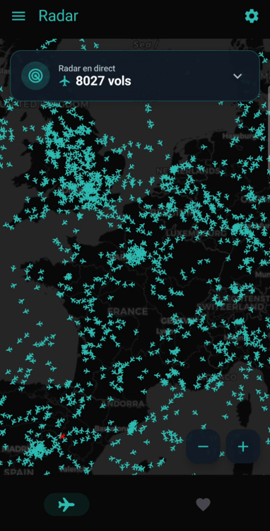
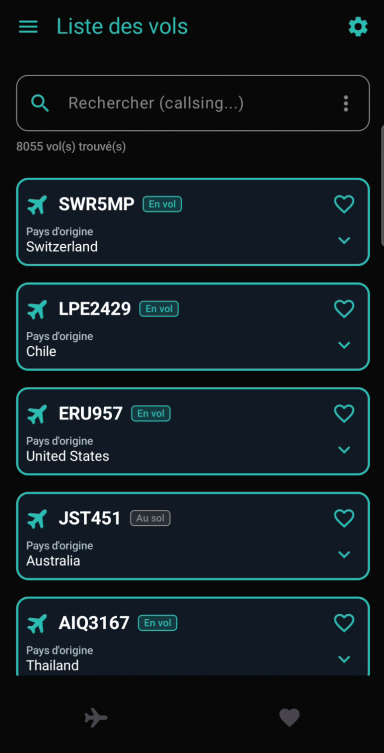
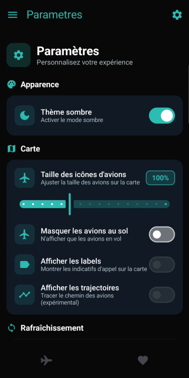

# FlightFinder

FlightFinder est une application Android développée en Kotlin offrant une visualisation et un suivi d'avions. L'interface est construite avec Jetpack Compose et Material3, et l'application propose des options de personnalisation (thème, options d'affichage, intervalle de rafraîchissement, etc.) sauvegardées localement.

## Fonctionnalités principales

- Carte interactive affichant les avions (icônes redimensionnables).
- Thème clair / sombre.
- Options d'affichage :
    - Masquer les avions au sol.
    - Afficher / masquer les labels d'avions (option actuellement désactivée dans l'UI).
    - Afficher les trajectoires (option actuellement désactivée dans l'UI).
- Auto-rafraîchissement configurable (avec confirmation utilisateur).
- Sélection de l'intervalle de rafraîchissement (en secondes).
- Réinitialisation des préférences aux valeurs par défaut.
- Vidage de la base de données via l'interface (action confirmée).
- Toutes les préférences sont persistées et appliquées en temps réel.

## Écrans / Pages

- `SettingsScreen` (`app/src/main/java/com/example/flightfinder/vues/SettingsScreen.kt`)  
  Écran complet de gestion des préférences utilisateur : apparence, options de carte, rafraîchissement, boutons dangereux (réinitialiser, vider BD) et footer d'information.

- Écran principal (carte / liste des vols)  
  (Référence via `MainViewmodel` — logique métier et actions globales comme `clearDatabase()`).

## Architecture & Technologies

- Langage : Kotlin (compose UI).
- UI : Jetpack Compose, Material3.
- Concurrency : Kotlin Coroutines.
- Persistance : Datastore de préférences utilisateur (implémentation dans `UserPreferencesRepository`), stockage local pour la base de données (Room ou autre — voir implémentation projet).

## Installation & exécution (Windows)

Prérequis :
- Android Studio
- JDK compatible

Étapes :
1. Ouvrir le projet dans Android Studio : `File > Open` et sélectionner le répertoire du projet.
2. Synchroniser Gradle si demandé.
3. Lancer l'application sur un émulateur ou appareil physique via Run / Debug.

## Développement — points d'intérêt

- `SettingsScreen` gère les thèmes et préférences via un `UserPreferencesRepository`. Les actions utilisateur déclenchent des coroutines pour mettre à jour les préférences.
- Les interrupteurs sensibles (ex. activation de l'auto-rafraîchissement) affichent des dialogues de confirmation avant d'appliquer le changement.
- Les composants réutilisables dans `SettingsScreen` :
    - `SettingsSection` : conteneur de sections paramétrables.
    - `ModernSettingsSwitch` : switch enrichi avec dialogue de confirmation optionnel.
    - `ModernSettingsSlider` : contrôle de valeur (ex. taille d'icône, intervalle).
    - `DangerButton` : bouton rouge avec confirmation pour actions destructrices.

Consulter les sources suivantes pour comprendre le flux :
- `app/src/main/java/com/example/flightfinder/vues/SettingsScreen.kt`
- `app/src/main/java/com/example/flightfinder/repository/UserPreferencesRepository.kt` (gestion des préférences)
- `app/src/main/java/com/example/flightfinder/MainViewmodel.kt`

## Bonnes pratiques

- Utiliser la coroutines scope fournie par le ViewModel pour modifications asynchrones.
- Centraliser les préférences et la logique d'accès aux données dans le repository (`UserPreferencesRepository`).
- Tester les dialogues de confirmation lors des changements d'options critiques.

## Contribution

- Forker le projet, créer une branche descriptive (`feature/nom`), ouvrir une Pull Request avec description claire.
- Respecter la structure du code et les conventions Kotlin / Compose.